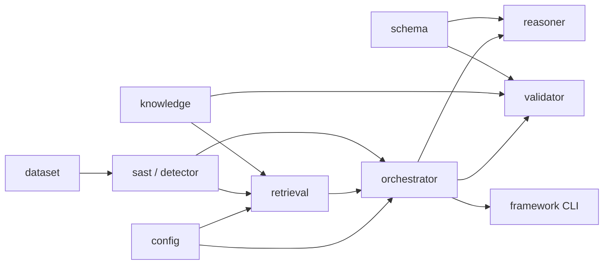

# Architecture

Thesis: **RAG-Augmented Multi-Agent LLM Framework for Explainable Software Vulnerability Detection Using CWE Knowledge Bases**
Student: Richa Verma (25MCSS02) · Advisor: Dr. Akshay Pandey

Advisor sequence (what to build when) is [`advisor-phase-plan.md`](advisor-phase-plan.md). This page is how packages compose. Cost-aware routing lives only in the orchestrator, not in the title.

## Data flow

```text
Java SeedUnit
    → SAST Evidence[]          (detector rules → structured evidence)
    → Hybrid RankedHit[]       (TF-IDF + SAST ids + CWE relationships, RRF)
    → ReasoningResult          (Assignment 4 JSON Schema)
    → ValidationReport
    → Metrics
```

External contract is `schemas/reasoning_output.schema.json`. Internally layers pass dataclasses (`SeedUnit`, `Evidence`, `RankedHit`, `ReasoningResult`, `ValidationReport`).

## Components



| Package | Responsibility | Status in this PR |
| --- | --- | --- |
| `dataset` | Load labels/split/source. No detection. | Implemented |
| `config` | Top-K, RRF k, LLM env names. No CWE facts. | Implemented |
| `detector` | Regex rules + binary `detect()`. | Implemented (A1) |
| `evidence` / SAST product objects | `Evidence` with file/lines/snippet | **Not implemented** (next) |
| `knowledge` | CWE store + get/search/relationships/mitigations | Implemented |
| `retrieval` | Index, TF-IDF, SAST signal, relationship expand, RRF | Implemented |
| `schema` | JSON Schema + `ReasoningResult` dump/load | **This PR** |
| `reasoner` | Unit + evidence + hits → `ReasoningResult` | Not implemented |
| `validator` | Schema + KB + cited lines + decision consistency | Not implemented |
| `orchestrator` | Wire steps, SAST-first, skip LLM if no key / evidence enough | Not implemented |
| `evaluate` / `framework` | Thin CLIs: A1 metrics vs full pipeline | A1 eval only |

## Rules

- No CWE encyclopedia text in the detector; names/mitigations come from `knowledge`.
- Retrieval does not call the reasoner.
- Reasoner does not open files or run the pipeline.
- Validator does not retrieve.
- Orchestrator does not inline regexes or CWE descriptions.
- LLM is optional; default path is offline. Skip policy belongs in the orchestrator.
