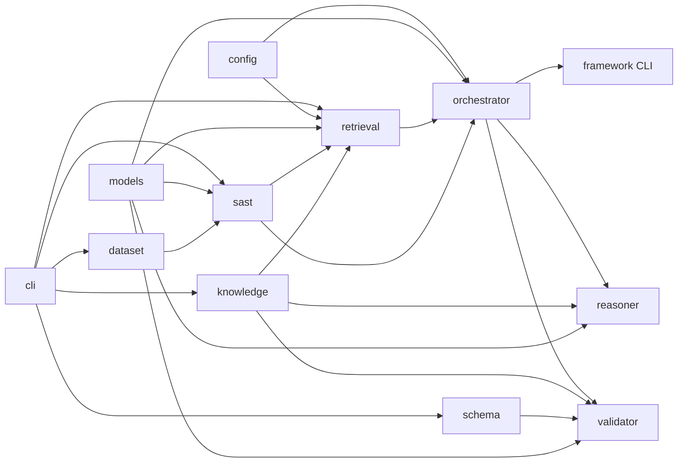

# Architecture

Thesis: **RAG-Augmented Multi-Agent LLM Framework for Explainable Software Vulnerability Detection Using CWE Knowledge Bases**
Student: Richa Verma (25MCSS02) · Advisor: Dr. Akshay Pandey

Advisor sequence: [`advisor-phase-plan.md`](advisor-phase-plan.md). Cost-aware routing lives only in the orchestrator, not in the title.

## Package tree

```text
src/cwe_vuln/
  config.py              shared knobs (repo_root, Top-K, RRF k, LLM env names, seed CWE ids)
  models/                DTOs only — Evidence, RankedHit, ReasoningResult, ValidationReport, metrics
  dataset/               load seed units, labels, 8/4 split
  knowledge/             CWE store + get/search/relationships/mitigations
  sast/                  regex detector + evidence extraction → Evidence[]
  retrieval/             TF-IDF index + SAST ids + relationship expand + RRF
  schema/                JSON Schema load + validate helpers
  reasoner/              unit + evidence + hits → schema-valid ReasoningResult
  validator/             schema + KB + cited lines + decision consistency
  orchestrator/          Pipeline wiring + SAST-first skip-LLM policy + ports
  framework/             cwe-vuln-pipeline CLI
  cli/                   baseline, knowledge, retrieval, schema, evidence entrypoints
```

Tests mirror packages under `tests/{dataset,knowledge,sast,retrieval,schema,reasoner,validator,orchestrator,framework}/`.
`data/` is the corpus. `schemas/` is the external JSON contract. `results/` is generated metrics. Java seeds stay in `data/seed/java/`.

## Data flow

```text
Java SeedUnit
    → SAST Evidence[]          (sast rules → structured evidence)
    → Hybrid RankedHit[]       (TF-IDF + SAST ids + CWE relationships, RRF)
    → ReasoningResult          (Assignment 4 JSON Schema)
    → ValidationReport
    → Metrics
```

External contract is `schemas/reasoning_output.schema.json`. Internally layers pass dataclasses from `models/` (`Evidence`, `RankedHit`, `ReasoningResult`, `ValidationReport`, `PipelineResult`). `SeedUnit` is owned by `dataset`.

## Components



| Package | Responsibility | Status |
| --- | --- | --- |
| `models` | Shared DTOs + one `binary_metrics`. No I/O, no rules. | Implemented |
| `dataset` | Load labels/split/source. No detection. | Implemented |
| `config` | `repo_root`, Top-K, RRF k, LLM env names, seed CWE ids. | Implemented |
| `sast` | Regex rules, `detect()`, `extract_evidence()`. CWE *hints* only. | Implemented |
| `knowledge` | CWE JSON store + query API (names, mitigations, relationships). | Implemented |
| `retrieval` | Index, TF-IDF, SAST signal, relationship expand, RRF. No reasoner. | Implemented (lexical) |
| `schema` | Draft 2020-12 load + `validate_output` / `is_valid`. | Implemented |
| `reasoner` | `TemplateReasoner.compose`. Caller passes units. | Implemented (no LLM) |
| `validator` | Schema + KB + cited lines + decision vs evidence. No retrieve. | Implemented |
| `orchestrator` | `Pipeline.run`; SAST-first; skip LLM without key / when evidence exists. | Implemented |
| `framework` | `cwe-vuln-pipeline` CLI + seed metrics. | Implemented |
| `cli` | Thin A1 / KB / retrieve / schema / evidence entrypoints. | Implemented |

## Rules

- No CWE encyclopedia text in the detector; names/mitigations come from `knowledge`.
- Retrieval does not call the reasoner.
- Reasoner does not open the dataset from disk (caller passes units).
- Validator does not retrieve.
- Orchestrator does not inline regexes or CWE descriptions.
- Layers do not import `orchestrator`. `models` imports nothing from agents.
- LLM is optional; default path is offline. Skip policy belongs in the orchestrator.
- Neural embeddings are **not** implemented. TF-IDF is a lexical vector space.
