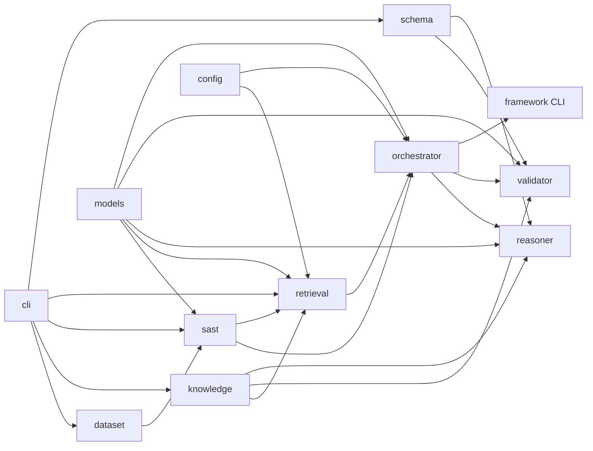

# Architecture

Thesis: **RAG-Augmented Multi-Agent LLM Framework for Explainable Software Vulnerability Detection Using CWE Knowledge Bases**
Student: Richa Verma (25MCSS02) · Advisor: Dr. Akshay Pandey

Advisor sequence: [`advisor-phase-plan.md`](advisor-phase-plan.md). Cost-aware routing lives only in the orchestrator, not in the title.

## Package tree

```text
src/cwe_vuln/
  config.py              shared knobs (repo_root, Top-K, RRF k, LLM env names, seed CWE ids)
  models/                DTOs only — Evidence, RankedHit, ReasoningResult, ValidationReport, metrics
  dataset/               load seed units, labels, 8/4 split
  knowledge/             CWE store + get/search/relationships/mitigations
  sast/                  regex detector + evidence extraction → Evidence[]
  retrieval/             Embedder port, MiniLM / TF-IDF, DenseIndex, SAST ids, relationship expand, RRF
  schema/                JSON Schema load + validate helpers
  reasoner/              Reasoner.reason → schema-valid ReasoningResult (template or LLM)
  validator/             schema + KB + cited lines + decision consistency
  orchestrator/          Pipeline wiring + SAST-first LLM routing + ports
  framework/             cwe-vuln-pipeline CLI
  cli/                   baseline, knowledge, retrieval, schema, evidence entrypoints
```

Tests mirror packages under `tests/{dataset,knowledge,sast,retrieval,schema,reasoner,validator,orchestrator,framework}/`.
`data/` is the corpus. `schemas/` is the external JSON contract. `results/` is generated metrics. Java seeds stay in `data/seed/java/`.

## Data flow

```text
Java SeedUnit
    → SAST Evidence[]          (sast rules → structured evidence)
    → Hybrid RankedHit[]       (MiniLM cosine or TF-IDF fallback + SAST ids + CWE relationships, RRF)
    → ReasoningResult          (Assignment 4 JSON Schema; template or LLM)
    → ValidationReport
    → Metrics
```

External contract is `schemas/reasoning_output.schema.json`. Internally layers pass dataclasses from `models/` (`Evidence`, `RankedHit`, `ReasoningResult`, `ValidationReport`, `PipelineResult`). `SeedUnit` is owned by `dataset`.

## Components



| Package | Responsibility | Status |
| --- | --- | --- |
| `models` | Shared DTOs + one `binary_metrics`. No I/O, no rules. | Implemented |
| `dataset` | Load labels/split/source. No detection. | Implemented |
| `config` | `repo_root`, Top-K, RRF k, LLM env names, `use_llm_if_available`, `skip_llm_when_sast_hits`. | Implemented |
| `sast` | Regex rules, `detect()`, `extract_evidence()`. CWE *hints* only. | Implemented |
| `knowledge` | CWE JSON store + query API (names, mitigations, relationships). | Implemented |
| `retrieval` | `Embedder.encode`, `MiniLMEmbedder`, `TfidfEmbedder` / `TfidfIndex`, `DenseIndex`, SAST signal, relationship expand, RRF. No reasoner. | Implemented (MiniLM + TF-IDF fallback) |
| `schema` | Draft 2020-12 load + `validate_output` / `is_valid`. | Implemented |
| `reasoner` | `Reasoner.reason`. `TemplateReasoner` offline default; `LLMReasoner` when a key exists. | Implemented (key-gated) |
| `validator` | Schema + KB + cited lines + decision vs evidence. No retrieve. | Implemented |
| `orchestrator` | `Pipeline.run`; SAST-first; construct LLM only if key present; log `path`. | Implemented |
| `framework` | `cwe-vuln-pipeline` CLI + seed metrics. | Implemented |
| `cli` | Thin A1 / KB / retrieve / schema / evidence entrypoints. | Implemented |

## Ports and fallbacks

**Embedder** (`retrieval/embed.py`): `encode(texts) -> 2-D array-like`. `MiniLMEmbedder` loads `all-MiniLM-L6-v2` from `.cache/` (downloads on first CLI run). Import of the package never requires the model. On import/download failure, `HybridRetriever` uses TF-IDF and records `embedder=tfidf_fallback`. Unit tests inject a tiny fake embedder.

**Reasoner** (`reasoner/`): `reason(unit, evidence, hits) -> ReasoningResult`. `TemplateReasoner` is the offline default. `LLMReasoner.from_env()` returns `None` without `GROQ_API_KEY` (or `CWE_VULN_LLM_API_KEY` override) — the orchestrator then never constructs it. Invalid LLM JSON is retried once, then `reasoner=llm_fallback_template`. Optional `CWE_VULN_LLM_MODEL` (default `llama-3.1-8b-instant`) and `CWE_VULN_LLM_BASE_URL`. Prompts live in `reasoner/prompts.py`, not in the orchestrator.

**Orchestrator routing** (not in the reasoner): always SAST first. No key → `sast_first_skip_llm` / `hybrid_retrieve_skip_llm` + template. Key present → `sast_then_llm` / `hybrid_retrieve_then_llm` unless `skip_llm_when_sast_hits`.

## Rules

- No CWE encyclopedia text in the detector; names/mitigations come from `knowledge`.
- Retrieval does not call the reasoner.
- Reasoner does not open the dataset from disk (caller passes units).
- Validator does not retrieve.
- Orchestrator does not inline regexes, CWE descriptions, or prompt blobs.
- Layers do not import `orchestrator`. `models` imports nothing from agents.
- LLM is optional; default path is offline. Skip/refine policy belongs in the orchestrator.
- Neural embeddings are implemented (MiniLM). TF-IDF remains the lexical baseline and the download fallback.
