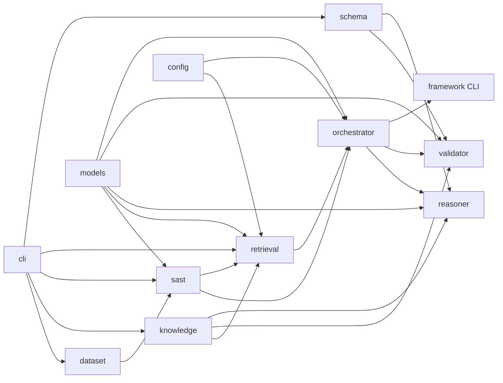

# Architecture

Thesis: **RAG-Augmented Multi-Agent LLM Framework for Explainable Software Vulnerability Detection Using CWE Knowledge Bases**
Student: Richa Verma (25MCSS02) · Advisor: Dr. Akshay Pandey

Advisor sequence: [`advisor-phase-plan.md`](advisor-phase-plan.md). Cost-aware routing lives only in the orchestrator, not in the title.

**Contribution this tree defends:** a RAG-augmented multi-agent detector for six Java CWEs where SAST emits evidence, hybrid MiniLM + relationship/RRF retrieves CWE knowledge, Groq produces A4-schema explanations, and a validator checks schema/lines/KB rather than SAST agreement. On an authored 24-unit FP/FN trap split, regex/template fail and the live LLM recovers most cases. Six public Java suite scores are a **separate** table ([`six-benchmark-results.md`](six-benchmark-results.md)). Not SOTA; not “first ever RAG-CWE detector”; six suites do not prove 100% novelty.

## Package tree

```text
src/cwe_vuln/
  config.py              shared knobs (repo_root, Top-K, RRF k, LLM env names, seed CWE ids)
  models/                DTOs only — Evidence, RankedHit, ReasoningResult, ValidationReport, metrics
  dataset/               load seed units, labels, 8/4 split; research corpus 36 units; six public suite adapters
  knowledge/             CWE store + get/search/relationships/mitigations
  sast/                  regex detector + evidence extraction → Evidence[]
  retrieval/             Embedder port, MiniLM / TF-IDF, DenseIndex, SAST ids, relationship expand, RRF
  schema/                JSON Schema load + validate helpers
  reasoner/              Reasoner.reason → schema-valid ReasoningResult (LLM default; template ablation)
  validator/             schema + KB + cited lines + JSON consistency (SAST disagreement = warning)
  orchestrator/          Pipeline wiring + SAST-then-LLM routing + ports
  framework/             cwe-vuln-pipeline CLI + cwe-vuln-eval research runner
  cli/                   baseline, knowledge, retrieval, schema, evidence entrypoints
```

Tests mirror packages under `tests/{dataset,knowledge,sast,retrieval,schema,reasoner,validator,orchestrator,framework}/`.
`data/` is the corpus. `schemas/` is the external JSON contract. `results/` is generated metrics. Java seeds stay in `data/seed/java/`.

## Data flow

```text
Java SeedUnit
    → SAST Evidence[]          (sast rules → structured evidence; not the decision)
    → Hybrid RankedHit[]       (MiniLM cosine or TF-IDF fallback + SAST ids + CWE relationships, RRF)
    → ReasoningResult          (Assignment 4 JSON Schema; Groq LLMReasoner)
    → ValidationReport         (schema / CWE-in-KB / cited lines / internal consistency)
    → Metrics
```

External contract is `schemas/reasoning_output.schema.json`. Internally layers pass dataclasses from `models/` (`Evidence`, `RankedHit`, `ReasoningResult`, `ValidationReport`, `PipelineResult`). `SeedUnit` is owned by `dataset`.

## Components



| Package | Responsibility | Status |
| --- | --- | --- |
| `models` | Shared DTOs + one `binary_metrics`. No I/O, no rules. | Implemented |
| `dataset` | Load labels/split/source. No detection. | Implemented |
| `config` | `repo_root`, Top-K, RRF k, LLM env names, `use_llm_if_available`, `skip_llm_when_sast_hits`. | Implemented |
| `sast` | Regex rules, `detect()`, `extract_evidence()`. CWE *hints* only. Not the final decision. | Implemented |
| `knowledge` | CWE JSON store + query API (names, mitigations, relationships). | Implemented |
| `retrieval` | `Embedder.encode`, `MiniLMEmbedder`, `TfidfEmbedder` / `TfidfIndex`, `DenseIndex`, SAST signal, relationship expand, RRF. No reasoner. | Implemented (MiniLM + TF-IDF fallback) |
| `schema` | Draft 2020-12 load + `validate_output` / `is_valid`. | Implemented |
| `reasoner` | `Reasoner.reason`. `LLMReasoner` is the live default; `TemplateReasoner` is `--offline` / `--ablation template`. | Implemented |
| `validator` | Schema + KB + cited lines + JSON consistency. `sast_disagreement` is a warning. | Implemented |
| `orchestrator` | `Pipeline.default()` requires Groq; `Pipeline.offline()` is the ablation. Log `path`. | Implemented |
| `framework` | `cwe-vuln-pipeline` CLI + seed metrics; `cwe-vuln-eval` research and Juliet suites. | Implemented |
| `cli` | Thin A1 / KB / retrieve / schema / evidence entrypoints. | Implemented |

## Ports and fallbacks

**Embedder** (`retrieval/embed.py`): `encode(texts) -> 2-D array-like`. `MiniLMEmbedder` loads `all-MiniLM-L6-v2` from `.cache/` (downloads on first CLI run). Import of the package never requires the model. On import/download failure, `HybridRetriever` uses TF-IDF and records `embedder=tfidf_fallback`. Unit tests inject a tiny fake embedder.

**Reasoner** (`reasoner/`): `reason(unit, evidence, hits) -> ReasoningResult`. `Pipeline.default()` constructs `LLMReasoner` and **fails** without `GROQ_API_KEY` (or `CWE_VULN_LLM_API_KEY` override). `Pipeline.offline()` / `cwe-vuln-eval --ablation template` uses `TemplateReasoner` for paper contrast (F1=0 on research_test). Invalid LLM JSON is retried once, then `reasoner=llm_fallback_template`. Optional `CWE_VULN_LLM_MODEL` (default `openai/gpt-oss-20b`) and `CWE_VULN_LLM_BASE_URL`. Prompts live in `reasoner/prompts.py`, not in the orchestrator.

**Orchestrator routing** (not in the reasoner): always extract SAST evidence first, then Groq decides. Default paths: `sast_then_llm` / `hybrid_retrieve_then_llm`. `--offline` or `skip_llm_when_sast_hits` uses template (`sast_first_skip_llm` / `hybrid_retrieve_skip_llm`).

## Rules

- No CWE encyclopedia text in the detector; names/mitigations come from `knowledge`.
- Retrieval does not call the reasoner.
- Reasoner does not open the dataset from disk (caller passes units).
- Validator does not retrieve and does not force the decision to match SAST.
- Orchestrator does not inline regexes, CWE descriptions, or prompt blobs.
- Layers do not import `orchestrator`. `models` imports nothing from agents.
- Default path is live Groq. Template/skip_llm are opt-in ablations.
- Neural embeddings are implemented (MiniLM). TF-IDF remains the lexical baseline and the download fallback.
