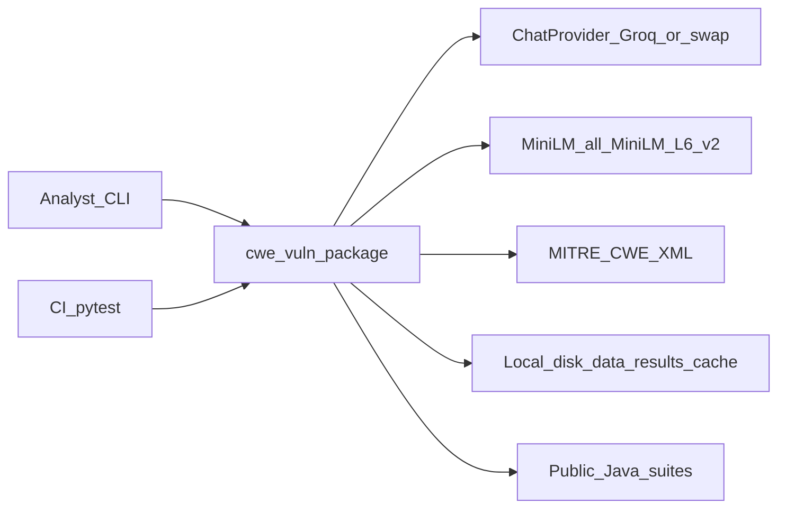
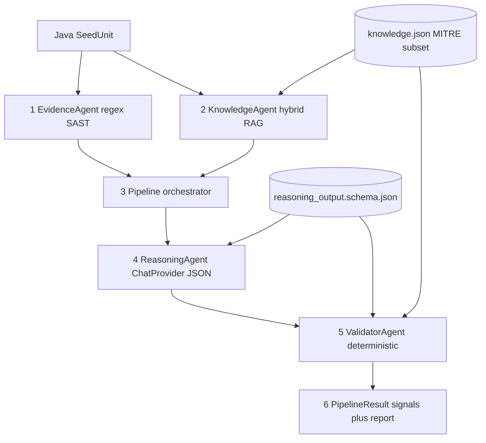
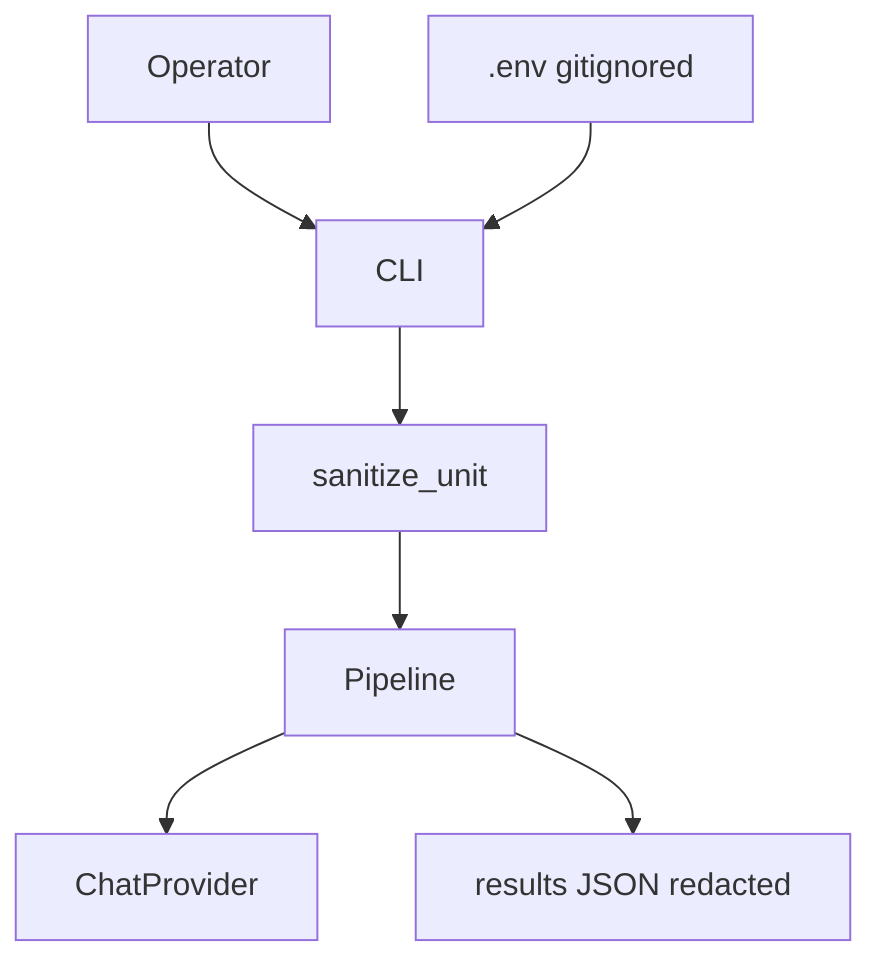
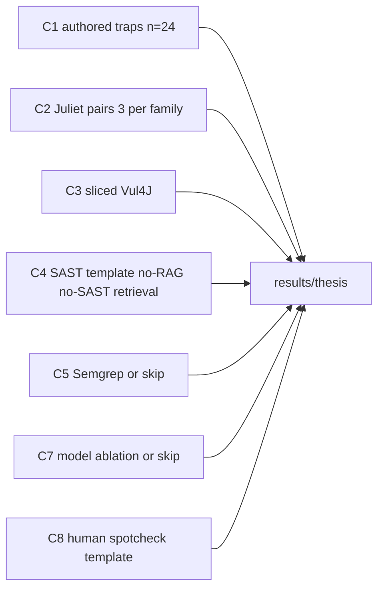

# High-Level Design (HLD)

| Field | Value |
| --- | --- |
| System | `cwe-vuln` (Python package, src-layout) |
| Official topic | RAG-Augmented Multi-Agent LLM Framework for Explainable Software Vulnerability Detection Using CWE Knowledge Bases |
| Student / advisor | Richa Verma (25MCSS02) / Dr. Akshay Pandey |
| Document type | High-level design — production-grade |
| Version | 1.0 |
| Status | As-built on branch `thesis-complete` plus explicit production contracts |
| Companion | [LLD](lld.md) |
| Code of record | `src/cwe_vuln/` · `schemas/reasoning_output.schema.json` · `data/` |

---

## 1. Purpose

This HLD defines **what** the system is, **who** uses it, **which** components exist, **which** external systems it depends on, and **which** non-functional contracts it must satisfy.

The product job is: take a Java source unit, emit **explainable** CWE-oriented vulnerability analysis (`decision`, CWE id/name, cited source lines, root cause, explanation, remediation), grounded in a structured CWE knowledge base — not a binary SAST fire/no-fire.

## 2. Scope

### 2.1 In scope (as-built)

- Offline Java **unit** analysis (one file / one method-level `SeedUnit`).
- Six thesis CWE families: 89, 79, 22, 502, 798, 327 (nearby public-suite ids kept, not relabeled).
- Regex SAST as **evidence**, not as the decision.
- Hybrid RAG over a MITRE CWE XML **subset** (catalog version recorded in `data/cwe/knowledge.json`).
- Named agents under a deterministic orchestrator (not free-form multi-LLM chat).
- Schema-bound LLM composition via an OpenAI-compatible `ChatProvider` (Groq default).
- Deterministic validator (schema, CWE-in-KB, cited lines, internal consistency).
- Reproducible evaluation CLIs and JSON result artifacts.
- Prompt sanitization so gold labels do not reach the LLM.

### 2.2 Out of scope (must not be claimed)

- Production SAST engine (no AST, no taint, not CodeQL / SpotBugs / Semgrep-as-engine).
- Full MITRE CWE catalog, C/C++/Python/RTL corpora, fine-tuning, LangChain/AutoGen orchestration.
- Multi-tenant SaaS, HTTP API, SSO, queue workers, horizontal autoscaling — **not implemented**. Specified below as production *targets*, not as current features.
- Exploit / payload generation (system prompt forbids it).
- Invented SOTA, “first RAG-CWE detector,” or CodeQL numbers we did not run.

### 2.3 Language and corpus honesty

Java only. Authored seed (12) + research traps (24) are **not** Juliet. Public-suite regex SAST on six named corpora is kept. Public-suite LLM rows from 2026-09-17 are **retracted** (gold-label leakage and/or silent 429→template). Replacement LLM numbers live under `results/thesis/` after a sanitized re-run.

---

## 3. Stakeholders and actors

| Actor | Role | Interface |
| --- | --- | --- |
| Analyst / student (Richa) | Runs pipeline and eval; reviews JSON reports | CLI (`cwe-vuln-*`) |
| Advisor | Reviews claims, architecture, metrics | Docs + `results/*.json` |
| CI | Unit tests, secret-guard; **no live LLM** | `uv run pytest` |
| Chat LLM provider | Schema JSON generation | HTTPS OpenAI-compatible `/chat/completions` |
| Hugging Face / local cache | MiniLM embeddings | `.cache/sentence-transformers/` |
| MITRE | CWE catalog XML | Download once → parse subset |
| Public suite hosts | Juliet / OWASP / … labeled Java | Gitignored trees under `data/benchmarks/` |

There is no end-user GUI and no unauthenticated public endpoint.

---

## 4. System context (C4 level 1)



**Trust boundary:** process-local Python + gitignored `.env`. API keys never leave the host except as `Authorization` to the configured provider. Raw LLM transcripts stay under gitignored `raw_llm/` / `results/**/raw_llm/`.

---

## 5. Containers (C4 level 2)

The as-built system is **one process**. Containers below are logical, not Docker services.

| Container | Technology | Responsibility | Persistence |
| --- | --- | --- | --- |
| `cwe-vuln` CLI process | Python 3.11+, `uv` | Orchestrate agents, write metrics | None (stateless per run) |
| Knowledge store | JSON file | MITRE subset CWE entries | `data/cwe/knowledge.json` (committed) |
| Corpora | JSONL + `.java` | Labeled units | `data/seed/`, `data/research/`; public trees gitignored |
| Embedding cache | sentence-transformers | MiniLM weights | `.cache/` gitignored |
| Result store | JSON/MD | Trial metrics, pair CI, disclaimers | `results/` |
| LLM provider | Groq (default) or OpenAI-compatible | Chat completions, temperature 0, JSON mode | Vendor-side |
| Env / secrets | `.env` via python-dotenv | Provider keys | gitignored; `.env.example` committed |

Production **target** (not built): wrap the same `Pipeline.run` behind an authenticated job API + object store for results. Do not rewrite agents to live in LangChain to “look production.”

---

## 6. Component architecture (C4 level 3)

ApproachDoc six stages, mapped 1:1 onto packages. The orchestrator is the only place that **routes** and fuses confidence.



| Stage | Package | Honest capability |
| --- | --- | --- |
| 1 Evidence | `agents.evidence` → `sast` | Six regex rules; pedagogical, not taint |
| 2 Knowledge | `agents.knowledge` → `retrieval.hybrid` | MiniLM + TF-IDF + SAST ids + 1-hop CWE relations, RRF; query = **evidence/sink window**, never gold `notes`, never file head |
| 3 Orchestrator | `orchestrator.pipeline` | Route **log**, risk, retrieval_confidence, coverage, fused confidence. Confidence is **logged, not gating**. Default path is always-LLM. |
| 4 Reasoner | `agents.reasoning` → `reasoner.llm` | Schema JSON; 429 re-raised; invalid JSON retried once then template **with** `fallback_reason` |
| 5 Validator | `agents.validation` → `validator` | schema / CWE-in-KB / cited_lines / consistency; SAST disagreement = **warning** |
| 6 Report | `models.pipeline.PipelineResult` | diagnostics + signals; CLI writes JSON |

Named agents are **thin wrappers** over port protocols (`EvidenceExtractor`, `UnitRetriever`, `UnitReasoner`, `UnitValidator`). The thesis “multi-agent” claim is specialized roles + structured messages, not a conversation bus.

Optional `CriticAgent` (`--ablation critic` / C7-style) is a second LLM review (ACCEPT/CHALLENGE/REJECT). **Default path stays deterministic validator.**

### 6.1 Layer rules (non-negotiable)

- `models/` : DTOs only. No I/O, no regex, no prompts.
- `dataset/` : load/sanitize units. No detection.
- `knowledge/` : CWE store + XML ingest. No ranking, no LLM.
- `sast/` : regex → `Evidence[]`. No decision, no CWE encyclopedia text.
- `retrieval/` : rank CWE passages. Does not instantiate the reasoner. Query is the evidence/sink window, never gold notes, never file head.
- `reasoner/` : talks to `ChatProvider`, not Groq/OpenAI SDK types. Does not load the dataset from disk.
- `validator/` : does not retrieve; does not force decision == SAST.
- `orchestrator/` : no inlined regexes, CWE prose, or prompt blobs.
- `llm/` : provider registry + OpenAI-compatible client. Reasoner does not hardcode URLs.
- `framework/` / `cli/` : process boundary. Evaluation integrity (sanitize, 429, raw capture) lives here for trials.
- Agents may wrap ports; they must not import `orchestrator.pipeline` at module import (avoids cycles).

### 6.2 Provider swap (production extensibility)

Any OpenAI-compatible host is a config change:

| Env | Role |
| --- | --- |
| `CWE_VULN_LLM_PROVIDER` | `groq` (default), `openai`, `together`, `openrouter`, `fireworks`, `deepseek`, `ollama`, `custom` |
| `CWE_VULN_LLM_API_KEY` | Universal override |
| Provider key | `GROQ_API_KEY`, `OPENAI_API_KEY`, … |
| `CWE_VULN_LLM_MODEL` / `CWE_VULN_LLM_BASE_URL` | Overrides |
| `CWE_VULN_LLM_JSON_MODE` | Disable `response_format=json_object` if the host rejects it |

A non-OpenAI-compatible vendor implements `ChatProvider.complete` and is passed into `LLMReasoner(provider=...)`. Named presets are one `register_provider(ProviderSpec(...))` row.

Verified Groq models on the thesis key (2026-09-18): `openai/gpt-oss-20b` (primary), `openai/gpt-oss-120b`, `qwen/qwen3.8-27b`. Dead names (`gemma2-9b-it`, retired Llama ids) must not be hardcoded.

---

## 7. Runtime data flow

```text
SeedUnit (gold label stays on the scoring copy)
    │
    ├─ sanitize_unit() ── opaque id, Snippet.java, comments blanked, bad→entry / good→alt
    │
    ├─ EvidenceAgent.extract ── regex spans (1-based lines)
    ├─ KnowledgeAgent.rank_for_unit ── evidence/sink window query → RankedHit{id, score, name, passage}
    │
    └─ Pipeline._route
           evidence?  + live LLM  → path sast_then_llm
           no evidence + live LLM → path hybrid_retrieve_then_llm
           offline / skip_llm     → sast_first_skip_llm | hybrid_retrieve_skip_llm
                │
                ▼
         ReasoningAgent.reason → ReasoningResult (A4 schema)
                │
                ▼
         ValidatorAgent.check → ValidationReport
                │
                ▼
         fuse_confidence + risk_score + retrieval_confidence + coverage
                │
                ▼
         PipelineResult.to_dict → CLI / results JSON
```

Scoring **always** uses the original unit’s `label` / `cwe_id`. The LLM only sees the sanitized copy. Failed units are listed, never scored as benign. Rate limits stop the suite (`rate_limited=true`); they are never converted into a silent template “live Groq” score.

---

## 8. Data architecture

### 8.1 Canonical records

| Record | Owner | Key fields |
| --- | --- | --- |
| `SeedUnit` | `dataset` | unit_id, cwe_id, path, split, label, notes, source, trap_type, corpus |
| `Evidence` | `models` | evidence_id, rule_id, cwe_id, path, start/end_line, snippet, rationale |
| `RankedHit` | `models` | cwe_id, score, name, passage |
| `ReasoningResult` | `models` | A4 schema dump |
| `ValidationReport` | `models` | passed, checks[], warnings[] |
| `PipelineResult` | `models` | path, diagnostics, signals |
| `CWEEntry` | `knowledge` | id, name, description, extended_description, relationships, mitigations, detection_notes |
| `ChatResult` | `llm` | text, tokens, latency_ms, finish_reason, provider, model |
| `Pair` | `framework.pairs` | Juliet good/bad counterpart |

External contract: Draft 2020-12 JSON Schema `schemas/reasoning_output.schema.json` (`additionalProperties: false`). Required: `schema_version=1.0`, `unit_id`, `decision∈{vulnerable,not_vulnerable,uncertain}`, `cwe{id,name}`, `supporting_source_lines`, `root_cause`, `explanation`, `remediation`. Optional: `confidence∈[0,1]`, `evidence_ids`.

### 8.2 Knowledge subset

- Source: MITRE `cwec_latest.xml.zip` (cached under gitignored `data/benchmarks/downloads/`).
- Builder: `cwe_vuln.knowledge.cwe_xml` — BFS 1-hop from seed + nearby public-suite ids; inverse ChildOf/ParentOf so e.g. CWE-798 children include 259 and 321.
- Committed artifact: `data/cwe/knowledge.json` with `meta.catalog_version`, `catalog_date`, `n_entries`, disclaimer “subset, not the full catalog.”
- Hand-written 20-entry store kept as `tests/fixtures/cwe/knowledge_handwritten.json`.

### 8.3 Result artifacts

| Path | Contents |
| --- | --- |
| `results/experiments/` | Authored research trials |
| `results/benchmarks/` | Six-suite regex SAST (kept); old LLM JSON retained but **retracted in docs** |
| `results/thesis/` | Sanitized C1–C8 runner output |
| `results/**/raw_llm/` | Per-unit raw completion (gitignored) |

Every trial JSON must carry `evaluation_scope`, `disclaimer`, `status`, and for live LLM: per-unit `fallback_reason`, tokens, latency, `rate_limited`.

### 8.4 Retention and privacy

- Do not commit `.env`, `gsk_` keys, or raw completions.
- Prompt copies must not contain gold tokens (`FLAW`, `FIX:`, `_vuln`, `method_bad`, `real=true`, gold CWE class names).
- Secret-guard pytest fails the build if `gsk_` appears in tracked files.

---

## 9. Integration architecture

| Integration | Direction | Protocol | Failure mode |
| --- | --- | --- | --- |
| Chat provider | Outbound | HTTPS OpenAI Chat Completions, temp=0, JSON mode | 429 → `RateLimitError` → trial backoff 12/30/60s then stop; 4xx/5xx → retry once if JSON, else template with reason; never swallow 429 as template |
| MiniLM | Local after first download | `sentence-transformers` | Import/download fail → `embedder=tfidf_fallback` (recorded) |
| MITRE XML | Outbound once | HTTP zip | Reuse cached `cwec_v*.xml` |
| Public suites | Outbound git/HTTP | Adapters in `dataset/` | Missing tree → skip/fail the suite honestly |
| dotenv | Local | File | Missing `.env` is OK; missing required key is hard fail on default path |

Timeouts: provider SDK defaults. Production target: explicit connect/read timeout + circuit breaker per provider. Not implemented yet — must be added before any service wrap.

---

## 10. Non-functional requirements

NFRs are split into **as-built** (what we actually guarantee today) and **production target**.

### 10.1 Functional correctness

| ID | Requirement | As-built |
| --- | --- | --- |
| F-1 | Default path is live LLM, not template | `Pipeline.default()` raises `MissingLLMKeyError` without a key |
| F-2 | SAST is evidence only | Validator does not fail on SAST disagreement |
| F-3 | RAG grounds the LLM | Hits include `passage` prose in the prompt |
| F-4 | No gold leakage into prompts | `sanitize_unit` + prompt-audit in `trial_pipeline` |
| F-5 | Rate limits are visible | `rate_limited=true`; suite stops; no silent fill-in |
| F-6 | Schema is the output contract | `jsonschema` Draft 2020-12 |

### 10.2 Reliability / availability

| ID | Target | As-built |
| --- | --- | --- |
| R-1 | CI green without network LLM | pytest mocks / env cleared in `conftest.py` |
| R-2 | Embedder optional | TF-IDF fallback |
| R-3 | Partial eval is labeled `partial` | Failed units excluded from scoring |
| R-4 | 99.9% API availability | **N/A** — no service. CLI is best-effort per invocation |
| R-5 | Idempotent trials | Deterministic sample seeds (`SAMPLE_SEED=13`); MiniLM/TF-IDF deterministic given inputs; LLM is not |

### 10.3 Performance / capacity

| ID | Contract | As-built observation |
| --- | --- | --- |
| P-1 | Prompt budget | `prompt_max_chars=4000`; window around evidence or sink |
| P-2 | Retrieval query | `retrieval_query_chars=1500` |
| P-3 | Top-K | `top_k=5`, RRF `k=60` |
| P-4 | Groq free-tier | ~200k tokens/day observed; ~8k TPM. C4-on-C1 then rebuilt C2 can exhaust TPD; C3/C4-on-C2 stay skipped. HTTP timeout 90s, `max_retries=0`. |
| P-5 | gpt-oss completion budget | Do **not** set tiny `max_completion_tokens` (reasoning tokens starve JSON) |
| P-6 | Latency SLO | Not a service. Per-unit `latency_ms` is recorded for the thesis, not gated |

### 10.4 Security

| ID | Control | Implementation |
| --- | --- | --- |
| S-1 | Secret hygiene | `.env` gitignored; secret-guard test; `redact()` on trial errors |
| S-2 | Least privilege | No cloud IAM; local filesystem + one provider key |
| S-3 | Prompt injection / gold leak | Sanitizer blanks comments, renames identifiers, opaque unit ids |
| S-4 | No exploit generation | System prompt forbids payloads/attacks |
| S-5 | Supply chain | `uv.lock`; pin Python ≥3.11 |
| S-6 | PII | Pedagogical Java only; do not ingest production customer code without a review |
| S-7 | SSRF | No user-controlled URL fetch on the default path; suite downloaders are explicit adapters |

### 10.5 Observability

As-built:

- Structured trial JSON (metrics, path counts, reasoner mix, tokens, latency, fallback_reason).
- `PipelineResult.diagnostics` + `signals`.
- Python `logging` on rate-limit and JSON fallback.
- Raw completions on disk for error taxonomy.

Production target (gap): OpenTelemetry traces around `Pipeline.run`, metrics (requests, 429s, token sum, validator pass rate), and a redacted log sink. Do not log API keys or full prompts in shared aggregators.

### 10.6 Maintainability / modularity

- Ports in `orchestrator/ports.py`.
- One `binary_metrics` implementation.
- Provider registry isolated from reasoner.
- Tests mirror packages under `tests/`.

### 10.7 Compliance / research integrity

- Cite only the six related-work PDFs + MITRE + suite URLs.
- Retract contaminated LLM numbers in `docs/six-benchmark-results.md`.
- CWE-502 is **not** in Juliet Java 1.3 — say so, do not fake recall.
- C7/C8 skip rather than invent.

---

## 11. Security architecture



Threats and mitigations:

| Threat | Mitigation |
| --- | --- |
| API key committed | gitignore + secret-guard pytest |
| Gold labels in prompt inflate F1 | Sanitizer + prompt_audit_leaks |
| Silent template scored as Groq | 429 re-raise; `fallback_reason`; `reasoner` mix in JSON |
| Prompt injection via comments | Comments blanked (spaces preserve line numbers) |
| Model generates exploits | System prompt; schema has no payload field |
| Path traversal via suite trees | Loaders read expected layouts; analysis is local |
| Dependency confusion | uv lockfile |

Authentication/authorization: **operator = whoever can run the CLI and read `.env`.** Production wrap must add identity before exposing `Pipeline.run` on a network.

---

## 12. Failure modes and error policy

| Event | Component | Policy |
| --- | --- | --- |
| Missing provider key | `Pipeline.default` | Exit 1, message lists env vars; `--offline` is opt-in ablation |
| HTTP 429 / TPD | `OpenAICompatProvider` / `LLMReasoner` | Re-raise `RateLimitError`; eval backoff then `status=partial\|failed`, `rate_limited=true` |
| Invalid JSON / schema | `LLMReasoner` | One retry; then `llm_fallback_template` **with** reason |
| MiniLM missing | `HybridRetriever.load` | TF-IDF; `embedder_name=tfidf_fallback` |
| Unknown CWE in output | `LLMReasoner._normalize` | Clamp to top retrieved/evidence KB id; record `cwe_clamped_from`. `CWE-0` does not reach the validator on the live path |
| Cited snippet wrong | Validator | `cited_lines` (raw) fail; `cited_lines_normalized` is a second check (indent-only). **No silent span rewrite** |
| Unit exception (non-429) | `trial_pipeline` | `failed_units`; not scored as TN |
| Juliet tree missing | thesis runner | trial `failed` / skip with error string |
| Semgrep missing | C5 | `skipped` — do not invent CodeQL |
| C7 TPD / C8 unlabeled | thesis runner | `skipped` / `human_spotcheck.json status=not_run` |

---

## 13. Routing and cost policy

Cost policy lives **only** in the orchestrator (`config.Settings`). The default live path is **always-LLM** (`skip_llm_when_sast_hits=False`). `final_confidence` is written onto `PipelineResult.signals` and is **not** consulted by `_route`. Do not describe this system as a cost-gated router.

| Knob | Default | Meaning |
| --- | --- | --- |
| `use_llm_if_available` | True | Live path |
| `skip_llm_when_sast_hits` | False | Always-LLM so we do not hide Groq cost |
| `--offline` / `--ablation template` | off | TemplateReasoner contrast |
| `--ablation skip-llm` | off | Old cost path (SAST hit → skip LLM); ablation only |
| `--resume` | off | Thesis runner skips trials with `status=ok` |
| `--max-tokens` | unset | Stop scheduling new live LLM trials at this recorded usage |

Paths recorded on every result: `sast_then_llm`, `hybrid_retrieve_then_llm`, `sast_first_skip_llm`, `hybrid_retrieve_skip_llm`.

Confidence fusion (ApproachDoc stage 6) is a **logged heuristic**, not a calibrated probability and not a gate:

`0.45 * llm_confidence + 0.25 * retrieval_confidence + 0.20 * sast_agreement + 0.10 * validator_pass`

Do not publish calibration plots without a held-out binning study.

---

## 14. Evaluation architecture



Entry: `uv run cwe-vuln-eval --suite thesis`.

Pair metric (primary public number): a Juliet pair is correct iff `bad → vulnerable` **and** matched `good* → not_vulnerable`. Bootstrap 95% CI is percentile resample in `framework.pairs.bootstrap_ci` (no extra deps).

---

## 15. Deployment and operations

### 15.1 As-built runbook

```bash
uv sync
cp .env.example .env   # set GROQ_API_KEY; never commit
uv run pytest          # no live LLM
uv run cwe-vuln-pipeline
uv run cwe-vuln-eval --suite research
uv run cwe-vuln-eval --suite thesis          # TPD-aware; 1–2 days
uv run cwe-vuln-eval --suite all-sast        # regex only
```

Python 3.11+. First retrieve/eval may download MiniLM into `.cache/`. Public suite trees are gitignored; adapters download on demand.

### 15.2 Production target (gap list)

To treat this as a shipped internal service, add in this order — **without** changing agent math:

1. Container image (`uv export` + non-root user); no `.env` in the image; keys from a secret manager.
2. Explicit HTTP timeouts, retry budget, and a provider health probe.
3. Job queue for batch units (Pipeline is already unit-scoped and side-effect light except LLM + disk).
4. Authn in front of any network API.
5. Metrics + traces (see §10.5).
6. SBOM / dependency scanning in CI.

### 15.3 Backup / DR

- Source of truth is git (`knowledge.json`, schemas, seed/research units, result JSON).
- Regenerable: MiniLM cache, public suite trees, CWE XML zip.
- Not regenerable: `.env` keys (operator vault), unpublished human spot-check labels.

---

## 16. Constraints and risks

| Risk | Impact | Handling |
| --- | --- | --- |
| Groq TPD 200k | Eval stops mid-suite | Partial JSON + 2-day schedule; never invent rows |
| Regex SAST overfitting to authored traps | Inflated contrast | Report public-suite SAST separately; keep “regex not AST” |
| Juliet comment leakage | Invalid LLM F1 | Sanitizer is mandatory on live path |
| gpt-oss reasoning tokens | Truncated JSON | Uncapped / large completion; record `finish_reason` |
| Uncalibrated `final_confidence` | Misread as probability | Documented weights only |
| Single rater C8 | No inter-rater κ | Status `not_run` until Richa labels |

---

## 17. CLI surface (process API)

| Script | Module | Purpose |
| --- | --- | --- |
| `cwe-vuln` | `cli.baseline` | A1 regex baseline |
| `cwe-vuln-kb` | `cli.knowledge` | KB demo/query |
| `cwe-vuln-retrieve` | `cli.retrieval` | Hybrid retrieve / eval |
| `cwe-vuln-schema` | `cli.schema` | Validate A4 JSON |
| `cwe-vuln-evidence` | `cli.evidence` | Dump Evidence[] |
| `cwe-vuln-pipeline` | `framework.cli` | End-to-end seed pipeline |
| `cwe-vuln-eval` | `framework.eval` | Research / public / `--suite thesis` |

This is the production API of the as-built system. Any future HTTP layer must call `Pipeline.run` and persist the same `PipelineResult.to_dict()` shape.

---

## 18. Document map

| Need | Where |
| --- | --- |
| Module APIs, sequences, algorithms | [LLD](lld.md) |
| Short package tree | [architecture.md](../architecture.md) |
| Cost knobs | [orchestrator.md](../orchestrator.md) |
| Schema fields | `schemas/reasoning_output.schema.json` |
| Retracted vs kept numbers | [six-benchmark-results.md](../six-benchmark-results.md) |

---

## 19. Acceptance of this HLD

A change is an HLD-breaking change if it: (a) makes template the default live path, (b) scores 429 as live Groq, (c) sends gold labels in prompts, (d) claims AST/taint/CodeQL, (e) hardcodes a vendor SDK in `reasoner/`, or (f) drops the A4 schema contract.
