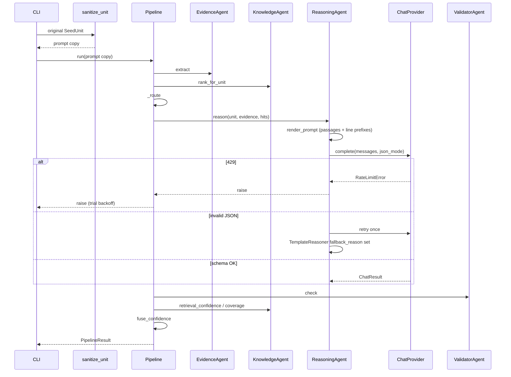

# Low-Level Design (LLD)

| Field | Value |
| --- | --- |
| System | `cwe-vuln` |
| Companion | [HLD](hld.md) |
| Version | 1.0 |
| Code of record | `src/cwe_vuln/` (src-layout, Python 3.11+) |
| Build | `pyproject.toml` · `uv` · `uv_build` |
| Package version | 0.9.0 |

This LLD specifies **how** each module implements the HLD: public APIs, call sequences, algorithms, on-disk formats, errors, configuration, and tests. Function and field names match the tree. Invented endpoints are labeled **not built**.

---

## 1. Repository layout

```text
src/cwe_vuln/
  __init__.py
  __main__.py                 # A1 baseline
  config.py                   # Settings, repo_root, env load
  llm/                        # ChatProvider port + OpenAI-compatible client + presets
  models/                     # DTOs only
  dataset/                    # SeedUnit, sanitize, six suite adapters, registry
  knowledge/                  # CWEKnowledgeBase + cwe_xml ingest
  sast/                       # RULES, detect, extract_evidence
  retrieval/                  # MiniLM, TF-IDF, DenseIndex, hybrid RRF
  schema/                     # JSON Schema load/validate
  reasoner/                   # prompts, LLMReasoner, TemplateReasoner
  validator/                  # ResultValidator
  agents/                     # Evidence, Knowledge, Reasoning, Validator, Critic
  orchestrator/               # ports, Pipeline, confidence, ablations
  framework/                  # pipeline CLI, eval, thesis, pairs
  cli/                        # thin A1/KB/retrieve/schema/evidence
schemas/reasoning_output.schema.json
data/cwe/knowledge.json
data/seed/  data/research/  data/retrieval/  data/benchmarks/
tests/                        # mirrors packages
results/                      # generated metrics
```

Import rule: layers do not import `orchestrator.pipeline`. `models` imports nothing from agents. `agents.reasoning` must not import `cwe_vuln.orchestrator` (circular: orchestrator → agents → orchestrator).

---

## 2. Configuration

### 2.1 `Settings` (`config.py`)

Frozen dataclass, process-global `settings = Settings()`.

| Field | Default | Used by |
| --- | --- | --- |
| `top_k` | 5 | `HybridRetriever.rank_for_unit` |
| `rrf_k` | 60 | `rrf_combine` |
| `prompt_max_chars` | 4000 | `render_prompt` |
| `retrieval_query_chars` | 1500 | `rank_for_unit`, `retrieval_confidence` |
| `use_llm_if_available` | True | `Pipeline._route` |
| `skip_llm_when_sast_hits` | False | `Pipeline._route` |
| `use_neural_if_available` | True | `HybridRetriever.load` |
| `minilm_model` | `all-MiniLM-L6-v2` | embedder |
| `default_llm_model` | Groq `openai/gpt-oss-20b` | reasoner |
| `default_llm_base_url` | `https://api.groq.com/openai/v1` | provider |

Methods: `llm_provider()`, `llm_api_key()`, `llm_ready()`, `llm_model()`, `llm_base_url()` delegate to `llm.spec`.

`repo_root()` walks parents until `data/seed/labels.jsonl`. `load_project_env()` loads repo-root `.env` with `override=False` (exported env wins).

`SEED_CWE_IDS = (CWE-89, 79, 22, 502, 798, 327)`. Knowledge load **fails** if any seed id is missing.

### 2.2 Environment catalog

| Variable | Required | Semantics |
| --- | --- | --- |
| `CWE_VULN_LLM_PROVIDER` | no | Default `groq` |
| `CWE_VULN_LLM_API_KEY` | no | Wins over provider-specific keys |
| `GROQ_API_KEY` | for default path | Groq |
| `OPENAI_API_KEY` / `TOGETHER_API_KEY` / … | if that provider | See `llm/spec.py` |
| `CWE_VULN_LLM_MODEL` | custom: yes | Model id |
| `CWE_VULN_LLM_BASE_URL` | custom: yes | OpenAI-compatible base |
| `CWE_VULN_LLM_JSON_MODE` | no | `0/false/off` disables JSON mode |
| `CWE_VULN_SKIP_MINILM` | no | Force TF-IDF (embed helper) |
| `CWE_VULN_DOWNLOAD_MINILM` | no | Allow first download |

`OPENAI_API_KEY` is **ignored** when provider is `groq`. Tests in `tests/reasoner/test_llm.py` lock this.

### 2.3 Provider registry (`llm/spec.py`)

`ProviderSpec(name, base_url, default_model, key_env, fallback_models, json_mode, requires_key, notes)`.

Presets: `groq`, `openai`, `together`, `openrouter`, `fireworks`, `deepseek`, `ollama` (`requires_key=False`), `custom`.

Groq fallbacks (verified 2026-09-18): `openai/gpt-oss-20b`, `openai/gpt-oss-120b`, `qwen/qwen3.8-27b`.

`register_provider(spec)` mutates the process dict (tests / extra hosts). `UnknownProviderError` if the name is missing.

---

## 3. Data dictionary

### 3.1 `SeedUnit`

| Field | Type | Invariant |
| --- | --- | --- |
| `unit_id` | str | Unique per corpus; prompt copy is `unit_` + sha1[:12] |
| `cwe_id` | str | `CWE-\d+` gold — **not** shown in prompt |
| `path` | str | Repo-relative or suite path; prompt copy `Snippet.java` |
| `split` | train/test/research_test/juliet | |
| `label` | vulnerable / not_vulnerable | Scoring only |
| `notes` | str | May contain gold; retrieval **must not** query notes |
| `source` | str | Java text; sanitizer preserves line count |
| `trap_type` | str | `seed` / trap name / suite |
| `corpus` | str | `seed` / `research` / suite name |

`is_vulnerable` ⇔ `label == "vulnerable"`.

### 3.2 `Evidence`

`evidence_id = "{unit_id}:{rule_id}:{start_line}"` (prompt unit_id, so opaque after sanitize). Lines 1-based inclusive.

### 3.3 `RankedHit`

`passage` is truncated CWE prose (≤700 chars in `passage_for`). Prompt JSON includes `passage` only if non-empty.

### 3.4 `ReasoningResult` ↔ schema

Dump/load via `to_dict` / `from_dict`. `schema_version` const `"1.0"`. `cwe.id` pattern `^CWE-[0-9]+$`. Span `start_line ≤ end_line`, both ≥ 1. Snippet is **verbatim source without** `NNNN| ` prefixes.

### 3.5 `PipelineResult`

| Group | Fields |
| --- | --- |
| Core | unit_id, path (route), evidence[], hits[], result, report |
| Reasoner | reasoner, embedder, model, provider |
| LLM diag | fallback_reason, n_attempts, prompt_tokens, completion_tokens, latency_ms, prompt_chars, truncated, slice_strategy |
| Signals | risk_score, retrieval_confidence, coverage, final_confidence |

`to_dict()` omits null diagnostics; always emits `signals`.

### 3.6 `CWEEntry` (knowledge.json schema_version 2)

`id, name, description, extended_description, consequences, abstraction, status, relationships{parents,children,peers}, mitigations[{id,title,text}], detection_notes`.

### 3.7 `ChatResult`

`text, prompt_tokens, completion_tokens, latency_ms, finish_reason, provider, model`.

### 3.8 Trial JSON (eval)

Minimum keys: `trial_id, date, suite, split, evaluation_scope, disclaimer, status, n_units, metrics|null, notes, error`. Live extras: `n_scored, rate_limited, skipped_due_to_rate_limit, failed_units, prompt_sanitized, prompt_audit_leaks, token_usage, unit_decisions, cwe_exact_match, cwe_parent_child_match, cwe_peer_match, cwe_family_match, validation_pass, cited_lines_*, cited_lines_normalized_*, abstain_rate, metrics_exclude_abstain, cwe_clamped_n`. Juliet pairs add `pair_metrics` + `pair_rows`. Fair SAST contrast: `sast_regex_sanitized_*` vs raw `sast_regex_*`.

`status ∈ {ok, partial, failed, skipped}`.

---

## 4. Ports and agents

### 4.1 Protocols (`orchestrator/ports.py`)

```text
EvidenceExtractor.extract(unit) -> list[Evidence]
UnitRetriever.rank_for_unit(unit) -> list[RankedHit]
UnitReasoner.reason(unit, evidence, hits) -> ReasoningResult
UnitValidator.check(result, unit, evidence) -> ValidationReport
```

Optional retriever methods (duck-typed in `Pipeline.run`): `retrieval_confidence(unit)`, `coverage(evidence, hits)`, `embedder_name`.

### 4.2 Agents

| Class | Wraps | Extra |
| --- | --- | --- |
| `EvidenceAgent` | `RegexEvidenceExtractor` | `name="evidence"` |
| `KnowledgeAgent` | `HybridRetriever` | `retrieval_confidence`, `coverage` |
| `ReasoningAgent` | any reasoner | `__getattr__` → backend diagnostics |
| `ValidatorAgent` | `ResultValidator` | |
| `CriticAgent` | `LLMReasoner._complete` | ACCEPT/CHALLENGE/REJECT; 429 re-raised |

`ReasoningAgent` types the backend as `Any` so it does not import `orchestrator`.

### 4.3 Ablation doubles (`orchestrator/ablations.py`)

`EmptyExtractor.extract` → `[]`. `EmptyRetriever.rank_for_unit` → `[]`, confidence 0, coverage `None`.

---

## 5. Sequence designs

### 5.1 Default live unit (`Pipeline.default().run`)



### 5.2 Evaluation trial (`trial_pipeline`)

For each original unit:

1. `prompt_unit = sanitize_unit(unit)`.
2. Optional `delay_seconds` (Juliet 1.5s, Vul4J 2.0s).
3. `pipeline.run(prompt_unit)`.
4. On 429 and `stop_on_rate_limit`: sleep 12, 30, 60s; if still limited, set `rate_limited`, skip remainder.
5. On other exceptions: append `failed_units`, **do not** score.
6. Score `y_pred` against **original** `unit.is_vulnerable`.
7. Prompt-audit `find_gold_tokens(last_prompt.text)`.
8. Write raw LLM file (redact `gsk_`).

CWE exact match: predicted `result.cwe.id == unit.cwe_id`. Family match: exact or parent/child. Peers are a **separate** column, not family.

### 5.3 Thesis runner order (`framework/thesis.py`)

C1 research SAST (raw + sanitized) + template + retrieval + live LLM → resume skips `status=ok`.  
C4 no-retrieval / no-SAST LLM on C1 (before C3).  
C2 Juliet pairs, **single-file variants only** (`_NNa/_NNb` excluded) + pair accuracy + bootstrap; incomplete pairs (TPD) excluded from accuracy.  
C4 no-retrieval on C2 only if TPD remains.  
C3 Vul4J sliced ±40 lines if local **and** TPD remains.  
C5 Semgrep `p/java` on pair files or skip.  
C7 model ablation only if `--include-model-ablation`.  
C8 write `human_spotcheck.json` `status=not_run`.

PAIR_PER_CWE = 3 (18 pairs / 36 units) for TPD. CWE-502 noted as absent in Juliet Java 1.3.

---

## 6. Algorithms

### 6.1 Regex SAST (`sast/detector.py`)

| rule_id | CWE | Pattern intent |
| --- | --- | --- |
| `sql_string_concat` | 89 | `"SELECT|INSERT|UPDATE|DELETE..." +` |
| `html_output_unencoded` | 79 | HTML tag concat not `htmlEncode(` |
| `file_path_concat` | 22 | `new File(... +` |
| `java_deserialization` | 502 | `ObjectInputStream` or `.readObject(` |
| `hardcoded_secret_literal` | 798 | password/apiKey/secret `= "..."` |
| `weak_crypto_algorithm` | 327 | `getInstance("MD5|DES|DESede|RC4|SHA-1|SHA1")` |

`detect()`: any match → predicted_label vulnerable. `extract_evidence()`: one `Evidence` per `finditer` match with 1-based span.

**Not** AST/taint. Seed-oriented; public-suite F1 is expected mediocre (kept as measured).

### 6.2 Passage index (`retrieval/hybrid.py`)

For each `CWEEntry`:

- `{id}::main` = id + name + description + extended_description + consequences
- `{id}::mitigations` = mitigation titles/texts
- `{id}::detection` = detection_notes

Rankers return passage ids; `_collapse` keeps max score per CWE and copies that passage onto `RankedHit`.

`rank_for_unit`:

```text
query = retrieval_query_text(unit)          # evidence/sink ±20 lines, NEVER unit.notes, NEVER file head
neural = MiniLM cosine ranking (or TF-IDF)
lexical = TF-IDF
sast    = match_rules(source) ids
related = 1-hop neighbors of sast (or neural[:3] or lexical[:3])
fused   = RRF(neural, sast, related)[:top_k]
```

RRF: for each ranking, `score[id] += 1/(rrf_k + rank)` with first-occurrence only.

`retrieval_confidence`: max cosine of neural (or lexical) top hit, clamped [0,1]. **Not calibrated.**

`coverage`: `|evidence_cwes ∩ hit_cwes| / |evidence_cwes|`, or `None` if no evidence.

### 6.3 Prompt window (`reasoner/prompts.py`)

Line prefixes `f"{n:>4}| "`. If full source ≤ `prompt_max_chars` → `full`. Else evidence min/max line ± 20, shrink to budget → `evidence_window`. Else first `_SINK_HINT` line → `sink_window`. Else file head → `head_window`.

LLM must cite **absolute** line numbers; snippet without prefixes.

### 6.4 Sanitizer (`dataset/sanitize.py`)

- Comments: line and block comments overwritten with spaces; newlines kept (line numbers stable).
- Strings left intact.
- Identifiers: `\bbadX` → `entryX`, `\bgoodX` → `altX`.
- Class-like `CWE89_...` / `Cwe798` → `SnippetN`.
- `notes` cleared; `unit_id` hashed; `path` = `Snippet.java`.

Gold-token audit (lowercase): `flaw`, `fix:`, `potential flaw`, `method_bad`, `method_good`, `file_bad`, `file_good`, `_bad`, `_good`, `real=true`, `real=false`, plus regex `(?<!not)_vuln(?!erable)` and `_fixed\b` so schema word `not_vulnerable` is not a false leak.

`slice_unit(pad=40)`: window around evidence or sink; **re-bases** lines to 1 because the slice **is** the unit (C3). Distinct from prompt windowing, which keeps absolute numbers on the full sanitized file.

### 6.5 LLM normalize (`reasoner/llm.py`)

After JSON parse: drop unknown keys; force `unit_id` and `schema_version`; if CWE id ∈ KB, overwrite **name** from KB (id stays model-chosen); force span `path` to unit.path; fill `evidence_ids` if missing.

**Does not** rewrite `start_line`/`end_line`/`snippet`. Wrong citations fail `cited_lines`. Unknown CWE ids (including `CWE-0`) are **clamped** to the top retrieved/evidence id that exists in the KB; `last_cwe_clamped_from` records the original. Allowed CWE ids are listed in the user prompt.

Retry: 2 attempts. Rate limits detected via `RateLimitError`, exception name, status 429, or text `rate limit` / `tokens per day` / `quota`.

### 6.6 TemplateReasoner

If evidence: `vulnerable` using evidence[0] span and that CWE’s first mitigation. Else: `not_vulnerable` using hits[0] or unit.cwe_id and a 1-line fallback span. Confidence 0.85 / 0.4. Ablation only.

### 6.7 Validator checks

| Check | Pass condition |
| --- | --- |
| `schema` | `is_valid(result.to_dict())` |
| `cwe_in_knowledge` | `result.cwe.id in kb.entries` |
| `cited_lines` | path matches; 1 ≤ start ≤ end ≤ nlines; snippet.strip() in excerpt or full source |
| `cited_lines_normalized` | same range; each line stripped of leading/trailing whitespace before containment |
| `internal_consistency` | unit_id match, decision enum, CWE pattern, non-empty text fields, confidence in [0,1] |

Warning `sast_disagreement`: vulnerable∧no evidence or not_vulnerable∧evidence. `uncertain` skips the warning. Warning does not fail `passed`.

### 6.8 Confidence fusion (`orchestrator/confidence.py`)

```
risk_score = 1 - 0.5**len(evidence)          # 0, 0.5, 0.75, …
sast_agreement = 1.0 if decision matches evidence presence else 0.3
                 (uncertain → 0.5)
final = clip01(0.45*llm_conf + 0.25*retrieval_conf
               + 0.20*sast_agreement + 0.10*(1.0 if passed else 0.4))
```

`llm_conf` defaults to 0.5 if omitted. Fusion is **logged on the result**; `_route` does not read `final_confidence`.

### 6.9 Routing (`Pipeline._route`)

```
can_llm = llm_reasoner is not None and use_llm_if_available
if has_evidence:
    return sast_then_llm if can_llm and not skip_llm_when_sast_hits else sast_first_skip_llm
return hybrid_retrieve_then_llm if can_llm else hybrid_retrieve_skip_llm
```

Default knobs yield always-LLM. `final_confidence` is not an input.

### 6.10 Pair metric + bootstrap

`pair_key`: strip `__(method_|file_)?(bad|good*)` from unit_id. Match min(#bad,#good) per stem. **Multi-file Juliet stems** (`_\d{2}[a-z]$`, e.g. `_81a`) are excluded from the pair pool: the sink often lives in a sibling file.

Pair correct iff bad decision `vulnerable` and good `not_vulnerable`. Any `uncertain` makes the pair incorrect and is counted in `n_abstain`. Binary `metrics` treat uncertain as not_vulnerable; `metrics_exclude_abstain` drops those units.

Bootstrap: `n_boot=1000`, percentile `alpha=0.05`, resample flags with `random.Random(seed)`.

### 6.11 CWE XML subset

Seed ids: thesis six + 80, 81, 83, 23, 36, 259, 321, 328. BFS hops=1 on views 1000 and 699. Inverse edges so ChildOf A→B implies B.children includes A.

---

## 7. LLM provider LLD

`ChatProvider` protocol: `name, model, base_url, api_key, complete(messages, json_mode=None) -> ChatResult`.

`OpenAICompatProvider.complete`:

- `OpenAI(api_key, base_url)`
- `chat.completions.create(model, messages, temperature=0, response_format=json_object?)`
- Map 429 → `RateLimitError`
- Record usage + `finish_reason` + latency

`from_env()` → `None` if required key missing (Ollama uses dummy key `ollama`).

`LLMReasoner.from_env()` → `None` similarly. `Pipeline.default()` treats None as `MissingLLMKeyError`.

Do not set a small `max_completion_tokens` on gpt-oss; reasoning tokens consume the budget before JSON closes.

---

## 8. CLI contracts

### 8.1 `cwe-vuln-pipeline`

```
--split {test,train,all}     default test
--output PATH
--offline                    TemplateReasoner ablation
```

Exit 1 on missing key. Writes `results/framework-seed.json` (+ `.md`). Sanitizes before `Pipeline.run`.

### 8.2 `cwe-vuln-eval`

```
--suite research|seed|all|thesis|juliet|juliet-sast|juliet-llm-sample|
        owasp-benchmark|...|*-llm-sample|all-sast
--ablation none|template|skip-llm
--offline / --skip-llm       aliases of template
--output-dir PATH
--juliet-tree PATH
--suite-tree PATH
--per-cwe INT                Juliet LLM sample size (not thesis pair_per_cwe)
--sample-n INT
--sample-seed INT            default 13
--include-model-ablation     C7
```

`--suite thesis` writes `results/thesis/` and does **not** fold into six-benchmark summary.

### 8.3 Other CLIs

`cwe-vuln`, `cwe-vuln-kb`, `cwe-vuln-retrieve`, `cwe-vuln-schema`, `cwe-vuln-evidence` remain assignment/debug tools. They must not call Groq unless documented.

---

## 9. Error catalog

| Type | Module | HTTP analog | Handling |
| --- | --- | --- | --- |
| `ConfigError` | config | 500 | repo_root missing |
| `MissingLLMKeyError` | config | 401 | default pipeline |
| `UnknownProviderError` | llm.spec | 400 | bad `CWE_VULN_LLM_PROVIDER` |
| `RateLimitError` | llm.errors | 429 | re-raise; eval backoff |
| `LLMError` | llm.errors | 502 | base |
| `DatasetError` | dataset.seed | 422 | bad labels.jsonl |
| `KnowledgeError` | knowledge.store | 404/422 | missing store / id |
| `JulietError` / `SuiteError` | adapters | 503 | missing tree |
| `ValueError` | provider | 400 | custom missing URL/model |

Eval `redact()` strips `gsk_` from error strings before JSON write.

---

## 10. File formats

### 10.1 `data/seed/labels.jsonl` / `data/research/labels.jsonl`

One JSON object per line: `unit_id, cwe_id, path, split, label, notes` (research adds trap fields). Java files under `data/seed/java/` and `data/research/java/`.

### 10.2 `data/cwe/knowledge.json`

```json
{ "meta": { "schema_version": "2", "source": "MITRE CWE XML catalog",
            "catalog_version": "...", "catalog_date": "...", "n_entries": N },
  "entries": [ CWEEntry, ... ] }
```

### 10.3 Retrieval queries

`data/retrieval/labeled_queries.jsonl`, `research_queries.jsonl`: `query_id, query, relevant_cwes, unit_id?`.

### 10.4 Raw LLM capture

`results/<dest>/raw_llm/<trial_id>/<unit_id>.json` — prompt metadata, raw text, errors, usage. Gitignored.

### 10.5 Human spot-check

`results/thesis/human_spotcheck.json`: `{status: not_run, n_target: 30, protocol, rows: []}`. Not filled in by automation.

---

## 11. Concurrency, state, threading

- Process is **synchronous** and single-threaded per CLI invocation.
- `LLMReasoner` instance fields (`last_*`) are **not** thread-safe; one reasoner per pipeline.
- `HybridRetriever` mutates `units_by_id` when ranking a unit (SAST signal). Do not share one retriever across threads without a lock.
- MiniLM encode is CPU/GPU bound; load once per process (`HybridRetriever.load`).
- Production job workers: **one Pipeline per worker process** (preferred) or mutex around `run`.

No database. No connection pool beyond the OpenAI SDK client created per `complete()` call (acceptable at thesis QPS; production should reuse a client).

---

## 12. Testing strategy

| Layer | Location | Live I/O |
| --- | --- | --- |
| Sanitizer / gold tokens | `tests/dataset/test_sanitize.py` | no |
| 429 not templated | `tests/reasoner/test_llm.py` | no (stub) |
| Provider registry | `tests/llm/` | no |
| Secret guard | `tests/framework/test_secret_guard.py` | git ls-files |
| Agents / fusion | `tests/agents/` | MiniLM if cached |
| Pairs / bootstrap | `tests/framework/test_pairs.py` | no |
| Thesis CLI template | `tests/framework/test_eval.py` | no key |
| Knowledge MITRE subset | `tests/knowledge/` | committed JSON |
| Passages / no-notes query | `tests/retrieval/test_passages.py` | no |

`tests/conftest.py` clears `GROQ_API_KEY`, `OPENAI_API_KEY`, `CWE_VULN_LLM_*`, and other provider keys so CI cannot accidentally call a network LLM.

**CI contract:** `uv run pytest` green; no Groq. Live commands are operator-run and documented with TPD.

---

## 13. Observability hooks (code)

| Signal | Where set |
| --- | --- |
| `path` | `Pipeline._route` |
| `reasoner` | `last_backend` (`llm` / `llm_fallback_template` / `template`) |
| `fallback_reason` | LLMReasoner after retry exhausted |
| `n_attempts` | 1 or 2 |
| tokens / latency | `ChatResult` |
| `slice_strategy` | `RenderedPrompt` |
| `risk_score` / `retrieval_confidence` / `coverage` / `final_confidence` | Pipeline.run |
| `rate_limited` | trial_pipeline |
| `prompt_audit_leaks` | find_gold_tokens on last prompt |

Logging: `logger.warning` on 429; `logger.info` on JSON fallback and critic failure.

---

## 14. Security controls (implementation)

| Control | Code |
| --- | --- |
| `.env` not tracked | `.gitignore` + test |
| `gsk_` scan | `tests/framework/test_secret_guard.py` |
| Error redaction | `framework.eval.redact` |
| Prompt gold strip | `sanitize_unit` |
| No exploit field | schema + SYSTEM_PROMPT |
| Comment blanking | `_rewrite_code` state machine |
| Opaque ids | `opaque_unit_id` |

Do not log `api_key`. `ChatProvider.api_key` exists on the object — never serialize `Pipeline` / provider into results.

---

## 15. Extension cookbook

| Change | Touch |
| --- | --- |
| New OpenAI-compatible host | `register_provider` or `CWE_VULN_LLM_PROVIDER=custom` |
| Non-OpenAI vendor | implement `ChatProvider`; pass to `LLMReasoner` |
| New regex CWE | add `Rule` in `sast/detector.py`; add CWE to XML seed ids; rebuild knowledge.json |
| New public suite | `dataset/<name>.py` + `registry.SUITES` |
| New validator check | `ResultValidator.check` tuple |
| Calibrated confidence | new module; do not silently retune weights on Juliet |
| HTTP API | wrap `sanitize_unit` + `Pipeline.run` + persist `to_dict()`; add auth |

---

## 16. Known implementation gaps vs production HLD

These are **explicit**, not accidental:

1. No HTTP API, auth, or multi-tenant isolation.
2. OpenAI client constructed per `complete()` (no shared timeout/circuit-breaker config).
3. Fusion weights not calibrated.
4. Regex SAST is pedagogical.
5. Knowledge is a MITRE **subset**.
6. No tracing/metrics backend.
7. `CriticAgent` is ablation-only.
8. Semgrep/CodeQL not in the default path.
9. Single-threaded eval; Groq TPD is the throughput cap.

Closing a gap requires a design delta against this LLD. Closing it by pretending (invented numbers, silent template, AST claims) is a defect.

---

## 17. Traceability matrix (HLD → code)

| HLD ID | Code |
| --- | --- |
| F-1 live default | `Pipeline.default`, `framework.cli` |
| F-2 SAST evidence | `validator.checks._sast_disagreement` |
| F-3 RAG prose | `RankedHit.passage`, `render_prompt` |
| F-4 sanitizer | `dataset.sanitize`, `trial_pipeline` |
| F-5 429 | `llm.provider._looks_like_rate_limit`, `LLMReasoner.reason` raise |
| F-6 schema | `schema/contract.py`, `schemas/reasoning_output.schema.json` |
| S-1 secrets | `.gitignore`, `test_secret_guard` |
| Stage 6 signals | `orchestrator/confidence.py`, `PipelineResult.signals` |
| Thesis eval | `framework/thesis.py`, `--suite thesis` |

---

## 18. Change control

LLD-breaking (needs HLD + test updates): altering A4 required keys; swallowing 429; querying `unit.notes` for retrieval; substituting evidence spans for failed citations; moving regex into the orchestrator; hardcoding Groq types in `reasoner/`.
